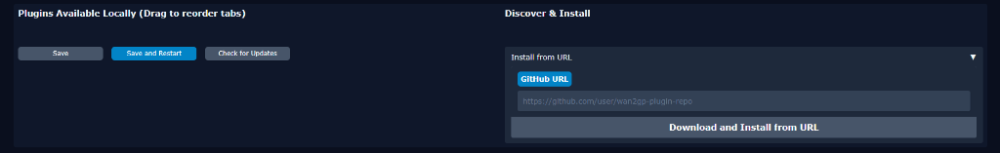

# 🧠 Smooth Brain — Wan2GP Plugin

AI-powered one-click short film generation for [Wan2GP](https://github.com/deepbeepmeep/Wan2GP).

## What It Does

Adds a **"🧠 Smooth Brain"** tab to Wan2GP that walks you through a 4-step wizard:

| Step | What happens |
|---|---|
| **1. Story Setup** | Enter a concept, set genre sliders, pick your models. Hit **Roll** — AI generates cinematic shot beats. |
| **2. Characters** | Upload up to 4 character reference images (optional). |
| **3. Storyboard** | Preview shots. Click **Generate All Images** to queue image renders via your loaded image model. |
| **4. Videos** | Set shot duration, click **Process Videos** — each shot queues into Wan2GP's render pipeline with auto-selected speed profiles. |

## AI Integration

The plugin uses **Ollama** for AI-powered story generation and prompt refinement.

> **Ollama auto-installs!** If Ollama isn't found on your system, the plugin automatically downloads, installs, and starts it in the background. It also pulls the default `qwen2.5:3b` model. No manual setup needed.

When Ollama is running, the plugin uses it for:
- **Story beat generation** — creates a cinematic shot list from your concept
- **Prompt refinement** — rewrites prompts for your chosen image and video models (LTX-2, Wan, HunyuanVideo)

If Ollama is unavailable, it silently falls back to built-in story templates (8 genres).

---

## Installation

### Option 1: Wan2GP Plugin Manager (Recommended)

1. Open Wan2GP and navigate to **Settings → Plugins**
2. In the **"Discover & Install"** section on the right, select **"GitHub URL"**
3. Paste the following URL:

```
https://github.com/TronikXR/smoothbrain
```

4. Click **"Download and Install from URL"**
5. Click **"Save and Restart"**



### Option 2: Manual Git Clone

1. Open a terminal and navigate to your Wan2GP plugins folder:

```bash
cd /path/to/wan2gp/app/plugins
```

2. Clone the repository:

```bash
git clone https://github.com/TronikXR/smoothbrain.git smooth_brain
```

3. Restart Wan2GP

> **Note:** The folder must be named `smooth_brain` (with underscore) inside the `app/plugins/` directory.

---

## Models Supported

Any model available in your Wan2GP installation. Optimized prompting guides included for:
- Wan 2.1 / 2.2 (I2V, T2V)
- LTX-2 (with automatic `Audio:` sentence injection)
- HunyuanVideo

## LTX-2 Notes

- Frame counts are automatically snapped to the nearest `8n+1` value (LTX-2 requirement)
- If Ollama is used, video prompts automatically get an `"Audio: ..."` sentence so LTX-2 generates intentional sound instead of random music

## File Structure

```
smooth_brain/
├── __init__.py          # Package marker
├── plugin.py            # Main Gradio UI (WAN2GPPlugin subclass)
├── ollama.py            # Ollama auto-setup + pack/refine pipeline
├── model_scanner.py     # Video/image model & speed profile scanner
├── prompt_guides.py     # Model-specific prompting guides
├── story_templates.py   # Offline fallback story templates (8 genres)
├── state.py             # Session state + render param builder
├── gpu_utils.py         # GPU detection & VRAM info
├── plugin_info.json     # Wan2GP metadata
├── docs/                # Screenshots for README
└── requirements.txt     # httpx
```

## API — Programmatic Access

You can call the Ollama pipeline directly from Python:

```python
from plugins.smooth_brain.ollama import pack

shots = pack(
    concept="A lone astronaut finds a signal on Europa",
    shot_count=6,
    genre_weights={"scifi": 80, "thriller": 40},
    image_model="i2v",
    video_model="ltx2_distilled",
)
# shots: [{ "prompt": "...", "shot_label": "...", "imagePrompt": "...", "videoPrompt": "..." }, ...]
```

```python
from plugins.smooth_brain.prompt_guides import format_guide_for_system_prompt

guide = format_guide_for_system_prompt("ltx2_distilled")
# Returns a formatted system prompt section for LTX-2
```

## License

MIT
