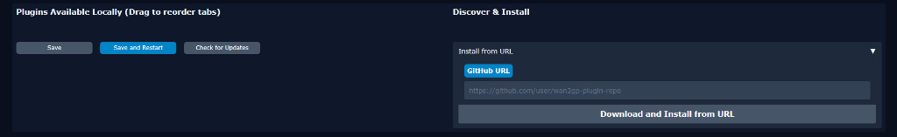

# 🧠 Tronik Slate (Smooth Brain)

> ⚠️ **Alpha Release** — This plugin is in active development. Core features work but expect bugs and breaking changes. Feedback and bug reports welcome!

AI-powered short film generation pipeline for [Wan2GP](https://github.com/deepbeepmeep/Wan2GP).

---

## Installation

### Standalone Web App (Full Features)

The full Tronik Slate app is a React + TypeScript web app with an Express backend. Requires [Node.js](https://nodejs.org/) 18+.

```bash
cd app
npm install
npm run dev
```

This starts both the Vite dev server (frontend) and the Express API server (backend) concurrently, typically at `http://localhost:5173`. On first launch, you'll be prompted to set your **Wan2GP location** (the `app/` folder inside your Wan2GP install).

> **Typical Pinokio path:** `F:\pinokio\api\wan.git\app`

### Gradio Plugin Only (Inside Wan2GP)

If you just want the 4-step wizard tab inside Wan2GP without the standalone app:

**Via Wan2GP Plugin Manager (Recommended):**
1. Open Wan2GP → **Settings → Plugins**
2. In **"Discover & Install"**, select **"GitHub URL"**
3. Paste:
   ```
   https://github.com/TronikXR/smoothbrain
   ```
4. Click **"Download and Install from URL"** → **"Save and Restart"**

**Via Git Clone:**
```bash
cd /path/to/wan2gp/app/plugins
git clone https://github.com/TronikXR/smoothbrain.git smooth_brain
```
> The folder must be named `smooth_brain` (with underscore) inside `app/plugins/`.



---

## User Workflows

### 🧠 Smooth Brain Mode (One-Click Films)

The fastest way to go from idea to video. Access via the **🧠** button in the toolbar.

| Phase | What You Do |
|---|---|
| **1. Story Setup** | Type a concept (e.g., "A samurai discovers time travel"). Set genre sliders (action, horror, comedy, etc.), pick a vibe (cinematic/vertical/square), choose your video + image models. Hit **Roll** — AI generates shot beats. |
| **2. Character Setup** | Upload up to 4 character reference images. AI can analyze them for consistent descriptions across shots. |
| **3. Storyboard** | Review generated shot cards. Edit prompts, reorder, approve/reject. Click **Generate All Images** to render reference frames. |
| **4. Video Export** | Set shot duration, click **Process Videos** — each shot queues into Wan2GP with auto-selected speed profiles. Approve/reject results per shot. |

### 🎬 Normal Mode (Full Editor)

The complete filmmaking workspace. Two views available:

**Storyboard View** (press `1`):
- Grid of shot cards showing thumbnails, prompts, and status
- Click a card to open the **Shot Editor** panel on the right
- Drag-and-drop to reorder shots
- Multi-select with Shift+Click for bulk operations

**Timeline View** (press `2`):
- Linear timeline with horizontal shot cards
- Drag to reorder the sequence

**Shot Editor** (right panel):
- Edit prompt text, negative prompts
- Upload start/end reference images
- Attach audio files and control videos
- Set per-shot parameters (model, seed, guidance, steps, etc.)
- Set number of video generation attempts per prompt
- Use optimized prompts (AI-refined versions)
- Dependency linking (chain shots so they render in order)

**Image Manager** (bottom panel):
- Browse and manage all images in the project
- Assign images to shots

**Audio Cropper** (bottom panel):
- Trim and crop audio clips for shot soundtracks

### 🎯 Skills Page

Browse and apply LoRA-based presets. Access via the **Skills** button in the toolbar.

- **Built-in Skills** — Motion Control, Lip Sync, and other curated presets
- **Your LoRAs** — Auto-scanned from Wan2GP's `loras/` folder
- **CivitAI Metadata** — Auto-fetches trigger words, previews, and model info
- Click any LoRA to preview it, then **Add Shot** to create a pre-configured shot

### 📦 Export Panel

Four ways to get your shots rendered. Access via the **Export** button in the toolbar.

1. **Queue Export** — Download a `queue.zip` file to drag into Wan2GP manually
2. **Headless Render** — Click **🚀 Render Now** to run Wan2GP's engine directly (no Gradio needed)
3. **Output Watcher** — Start watching Wan2GP's `outputs/` folder for auto-import of finished videos
4. **Assemble Rough Cut** — Stitch all shot videos into a single .mp4 (with optional audio mixing)

**Pre-flight Check**: Before exporting or rendering, the system validates all selected shots for missing inputs, model compatibility, and configuration issues.

**Batch Sweep**: Enable **🎲 Sweep** to generate multiple copies of each shot with varied parameters (seed, guidance scale, shift, sample steps).

---

## Connecting to Wan2GP — Detailed

### Method 1: Gradio Plugin (Inside Wan2GP)

The Smooth Brain plugin adds a **"🧠 Smooth Brain"** tab directly in Wan2GP's UI with the 4-step wizard. Uses Wan2GP's `process_tasks_cli` for in-process rendering. Best for simple, integrated workflows.

### Method 2: Headless CLI Render

Tronik Slate's Export panel spawns Wan2GP's Python engine as a subprocess, feeds it a `queue.zip`, and shows real-time progress via SSE. Features:
- Real-time progress bar with per-task tracking
- Cancel/Resume support
- Topological sort for shot dependencies
- Model grouping to minimize model swaps

### Method 3: Output Watcher

Watches Wan2GP's `outputs/` directory and auto-imports videos into your project. Works with any render method — Gradio UI, headless, API, or scripts. Uses SSE for real-time notifications.

### Method 4: Queue Export

Builds a `queue.zip` with prompts, parameters, and embedded images. Drag into Wan2GP's queue or unzip manually. Works across machines.

---

## First-Time Wan2GP Setup

On first launch, Tronik Slate shows a path configuration modal:

- **Manual Path** — Paste your Wan2GP `app/` folder path
- **Auto-Scan** — Click "Let me scan for it" to search a parent folder recursively

The folder should contain `defaults/`, `finetunes/`, and `outputs/`. You can change this later in the **⚙️ Parameters** tab.

Once connected, Tronik Slate automatically scans models, LoRAs, speed profiles, and GPU info from your Wan2GP installation.

---

## Keyboard Shortcuts

| Shortcut | Action |
|---|---|
| `Ctrl+Z` | Undo |
| `Ctrl+Y` / `Ctrl+Shift+Z` | Redo |
| `Ctrl+S` | Save project |
| `1` | Switch to Storyboard view |
| `2` | Switch to Timeline view |
| `N` | New shot (after selected) |
| `D` | Duplicate selected shot |
| `Delete` | Remove selected shot(s) |
| `A` | Toggle shot approval |
| `↑` / `↓` | Navigate between shots |
| `Escape` | Close active panel |
| `?` | Toggle hint overlays |

---

## AI Integration

Uses **Ollama** for AI-powered story generation and prompt refinement.

> **Ollama auto-installs!** If Ollama isn't found, the plugin automatically downloads, installs, and starts it in the background. It also pulls the default `qwen2.5:3b` model.

When running, Ollama powers:
- **Story beat generation** — cinematic shot lists from your concept
- **Prompt refinement** — model-specific rewrites (LTX-2, Wan, HunyuanVideo)
- **Character vision** — analyzes uploaded images for cross-shot consistency

Falls back to built-in story templates (8 genres) when offline.

---

## Models Supported

Any model in your Wan2GP installation. Optimized prompting guides for:
- Wan 2.1 / 2.2 (I2V, T2V)
- LTX-2 (with automatic `Audio:` sentence injection)
- HunyuanVideo

### LTX-2 Notes
- Frame counts auto-snap to `8n+1` (LTX-2 requirement)
- Video prompts get an `"Audio: ..."` sentence for intentional sound generation

---

## File Structure

```
TronikSlate/
├── app/                         # Full web app (React + Vite + TypeScript)
│   ├── src/
│   │   ├── components/          # UI components
│   │   │   ├── SmoothBrain/     # 4-step wizard UI
│   │   │   ├── ShotEditor/      # Per-shot editing + wan2gp path config
│   │   │   ├── Export/          # Export panel (all 4 render methods)
│   │   │   ├── Storyboard/     # Grid storyboard view
│   │   │   ├── Timeline/       # Linear timeline view
│   │   │   ├── Skills/         # LoRA-based skill presets
│   │   │   ├── ImageManager/   # Image gallery
│   │   │   ├── AudioCropper/   # Audio trimming
│   │   │   ├── VideoImport/    # External video import
│   │   │   └── Layout/         # App shell, toolbar, welcome screen
│   │   └── stores/             # Zustand state management
│   └── server/
│       └── routes/             # Express API routes
│           ├── render.ts       # Headless CLI rendering
│           ├── watcher.ts      # Output watcher
│           ├── export.ts       # Queue ZIP export
│           ├── models.ts       # Model/profile scanning
│           └── loras.ts        # LoRA scanning + CivitAI
│
├── plugin.py                   # Wan2GP Gradio plugin (refactored w/ mixins)
├── ui_builder.py               # Plugin UI mixin
├── wiring.py                   # Plugin event wiring mixin
├── render_engine.py            # Plugin render engine mixin
├── state.py                    # Session state + project persistence
├── model_scanner.py            # Model & speed profile scanner
├── ollama.py                   # Ollama auto-setup + prompt pipeline
├── prompt_guides.py            # Model-specific prompting guides
├── story_templates.py          # Offline story templates (8 genres)
├── gpu_utils.py                # GPU detection & VRAM info
├── constants.py                # Shared constants
├── plugin_info.json            # Wan2GP plugin metadata
└── requirements.txt            # httpx
```

## API — Programmatic Access

```python
from plugins.smooth_brain.ollama import pack

shots = pack(
    concept="A lone astronaut finds a signal on Europa",
    shot_count=6,
    genre_weights={"scifi": 80, "thriller": 40},
    image_model="i2v",
    video_model="ltx2_distilled",
)
# [{ "prompt": "...", "shot_label": "...", "imagePrompt": "...", "videoPrompt": "..." }, ...]
```

```python
from plugins.smooth_brain.prompt_guides import format_guide_for_system_prompt

guide = format_guide_for_system_prompt("ltx2_distilled")
# Returns a formatted system prompt section for LTX-2
```

## License

MIT
